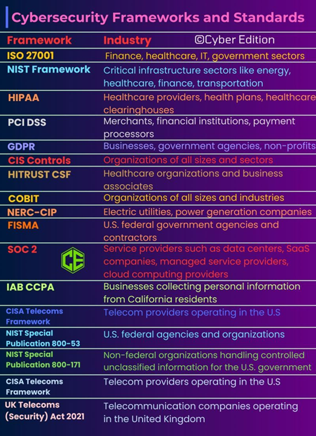

## GESTIÓN DE LA CIBERSEGURIDAD.

La gestión de la ciberseguridad es un enfoque integral para proteger los activos digitales de una organización, garantizando la confidencialidad, integridad y disponibilidad de la información frente a amenazas cibernéticas. Su propósito principal es minimizar los riesgos asociados a ataques informáticos, fraudes y vulnerabilidades tecnológicas mediante la implementación de estrategias preventivas, reactivas y correctivas. Entre las principales estrategias se incluyen la identificación y evaluación de riesgos, la adopción de políticas y normativas de seguridad, la capacitación del personal, el monitoreo continuo de amenazas y la respuesta ante incidentes. Una gestión efectiva de la ciberseguridad permite a las organizaciones operar en entornos digitales de manera segura, asegurando la confianza de usuarios y clientes en sus sistemas y servicios.

