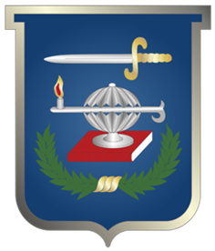
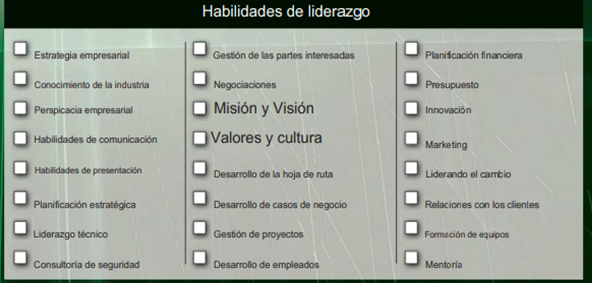
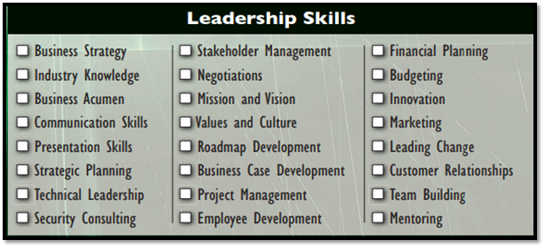

# Taller Ciber Líder

## Alumnos

* Andres Camilo Cotes Cadena
* Miguel David Giraldo Gaitán
* Rivas Camacho Diego
* Saba Corredor Danilo

## Docente

* Doctor Jaider Ospina

## Comunicación Social

* Escuela Superior de Guerra
* Bogotá D.C. 17 de marzo 2025

---

# TALLER CIBER LIDER

## MAPA MENTAL

### Habilidades de liderazgo

1.  **Habilidades de liderazgo:** Capacidad de influir, motivar y guiar a un grupo de personas para alcanzar un objetivo.

### Estrategia empresarial

2.  **Estrategia empresarial:** Plan de acción que define cómo una empresa va a competir en el mercado para alcanzar objetivos.
    * Ejemplo: Diversificar la oferta de productos.

### Conocimiento de la industria

3.  **Conocimiento de la industria:** Información que se tiene sobre la funcionalidad de la empresa o la industria.
    * Ejemplo: Conocer el mercado, servicios y los proveedores.

### Perspicacia empresarial

4.  **Perspicacia empresarial:** Capacidad de una persona para comprender y manejar situaciones de comercio mediante el conocimiento, habilidades y experiencia.
    * Ejemplo: Un gerente de marketing que planifica campañas que convencen a los consumidores ajustándose al presupuesto.

### Habilidades de comunicación

5.  **Habilidades de comunicación:** Capacidades que permiten a una persona comunicarse de manera efectiva.
    * Ejemplo: Demostrar autoridad y coherencia entre lo que se dice y lo que se hace.

### Habilidades de presentación

6.  **Habilidades de presentación:** Las capacidades y cualidades necesarias para crear y presentar una presentación convincente que comunique eficazmente información e ideas.
    * Ejemplo: Claridad, preparación para expresar el mensaje de manera concisa.

### Planificación estratégica

7.  **Planificación estratégica:** Proceso que define la dirección de una empresa a largo plazo.
    * Ejemplo: Apple, la cual se basa en la innovación y expansión de nuevos mercados.

### Liderazgo técnico

8.  **Liderazgo técnico:** Encargado de seleccionar e impulsar el desarrollo y la implementación de soluciones técnicas de los procesos de la empresa.
    * Ejemplo: Toma de decisiones tecnológicas claves para el éxito de la empresa.

### Consultoría de seguridad

9.  **Consultoría de seguridad:** Servicio especializado en el que expertos en seguridad analizan, diseñan e implementan estrategias para proteger activos, infraestructuras, información y personal contra diversas amenazas. Puede abarcar seguridad física, ciberseguridad, seguridad operacional y cumplimiento normativo.
    * Ejemplo: Contratación de personal experto para análisis de riesgos.

### Gestión de las partes interesadas

10. **Gestión de las partes interesadas:** Proceso de identificar, analizar, involucrar y comunicarse con todas las personas, grupos u organizaciones que tienen algún interés o impacto en un proyecto o iniciativa.
    * Ejemplo: Implementando una nueva plataforma de ciberseguridad para las FFMM, se identifican partes externas e internas.

### Negociaciones

11. **Negociaciones:** Proceso de comunicación estratégica entre dos o más partes con intereses, objetivos o posiciones diferentes, con el propósito de llegar a un acuerdo mutuamente beneficioso.
    * Ejemplo: Análisis previo entre las partes para adquirir una solución avanzada en ciberseguridad para las FFMM.

### Misión y visión

12. **Misión y visión:** Explica la razón de ser de la organización, qué hace, para quién lo hace y cómo lo hace. Se enfoca en el presente y Describe la meta a largo plazo, hacia dónde se dirige la organización y qué aspira a lograr en el futuro. Se enfoca en el futuro.
    * Ejemplo: "Proteger la soberanía digital de Colombia mediante la vigilancia, detección y respuesta a amenazas cibernéticas, garantizando la seguridad de la información y la infraestructura crítica de las Fuerzas Militares."

### Valores y cultura

13. **Valores y cultura:** La capacidad de fomentar una cultura organizacional positiva que esté alineada con los valores de la organización.
    * Ejemplo: Un líder que promueve un ambiente de trabajo inclusivo y colaborativo donde se valora la diversidad y se fomenta el respeto mutuo.

### Desarrollo de la hoja de ruta

14. **Desarrollo de la hoja de ruta:** La capacidad de crear un plan detallado para alcanzar una meta específica, identificando los pasos necesarios y estableciendo plazos.
    * Ejemplo: Un gerente de producto que desarrolla una hoja de ruta para el lanzamiento de un nuevo producto, definiendo las características, el cronograma y los recursos necesarios.

### Desarrollo de casos de negocio

15. **Desarrollo de casos de negocio:** La capacidad de analizar una oportunidad de negocio y desarrollar un argumento sólido para invertir en ella.
    * Ejemplo: Un analista de negocios que desarrolla un caso de negocio para la expansión a un nuevo mercado, demostrando el potencial de retorno de la inversión.

### Gestión de proyectos

16. **Gestión de proyectos:** La capacidad de planificar, ejecutar y controlar proyectos de manera efectiva.
    * Ejemplo: Un gerente de proyecto que utiliza herramientas de gestión de proyectos para realizar un seguimiento del progreso, gestionar el presupuesto y garantizar que el proyecto se complete a tiempo y dentro del presupuesto.

### Desarrollo de empleados

17. **Desarrollo de empleados:** La capacidad de identificar y desarrollar el potencial de los empleados.
    * Ejemplo: Un gerente que proporciona retroalimentación constructiva y oportunidades de capacitación para ayudar a los empleados a mejorar sus habilidades y avanzar en sus carreras.

### Planificación financiera

18. **Planificación financiera:** La capacidad de gestionar los recursos financieros de una organización de manera efectiva.
    * Ejemplo: Un director financiero que desarrolla un presupuesto anual y supervisa el flujo de caja de la empresa.

### Presupuesto

19. **Presupuesto:** La capacidad de crear y gestionar un presupuesto.
    * Ejemplo: Un jefe de departamento que elabora un presupuesto detallado para su departamento, asignando recursos a diferentes actividades y proyectos.

### Innovación

20. **Innovación:** La capacidad de generar y aplicar nuevas ideas para mejorar productos, servicios o procesos.
    * Ejemplo: Un ingeniero que desarrolla una nueva tecnología que mejora significativamente la eficiencia de un producto.

### Marketing

21. **Marketing:** La capacidad de promocionar productos o servicios y atraer clientes.
    * Ejemplo: Un gerente de marketing que desarrolla una campaña publicitaria para aumentar el conocimiento de la marca y generar clientes potenciales.

### Liderando el cambio

22. **Liderando el cambio:** La capacidad de guiar a una organización a través de períodos de cambio.
    * Ejemplo: Un CEO que lidera la transformación digital de una empresa, implementando nuevas tecnologías y procesos para mejorar la eficiencia y la competitividad.

### Relaciones con los clientes

23. **Relaciones con los clientes:** La capacidad de construir y mantener relaciones positivas con los clientes.
    * Ejemplo: Un representante de servicio al cliente que resuelve los problemas de los clientes de manera rápida y efectiva, brindando una experiencia positiva.

### Formación de equipos

24. **Formación de equipos:** La capacidad de construir y liderar equipos de alto rendimiento.
    * Ejemplo: Un entrenador deportivo que motiva a un grupo de atletas a trabajar juntos para alcanzar una meta común.

### Mentoría

25. **Mentoría:** La capacidad de guiar y apoyar el desarrollo de otros.
    * Ejemplo: Un líder experimentado que brinda orientación y apoyo a un empleado junior, ayudándolo a desarrollar sus habilidades y avanzar en su carrera.

---

# CENTRO DE MANDO

### Centro de Comando

1.  **Centro de Comando:**
    * Descripción: Este es el eje central donde se gestionan todos los informes y se coordinan las acciones de respuesta. Se reciben informes de diversos orígenes y se decide cómo proceder.
    * Ejemplo: Después de recibir el informe del empleado sobre el correo sospechoso, el equipo del Centro de Comando evalúa la amenaza potencial y determina el siguiente paso.

### Notificaciones de Terceros

    * Descripción: En ciertos casos, se requiere informar a terceros sobre la situación, ya sea por políticas internas o requisitos legales.
    * Ejemplo: Si se descubre que datos sensibles han sido comprometidos en una violación de datos, se notifica a los proveedores afectados o a otras entidades relevantes.

### Usuarios o Help Desk Reportan Problemas

    * Descripción: Los empleados de la organización o el equipo de soporte técnico identifican y reportan problemas relacionados con la seguridad.
    * Ejemplo: Un empleado detecta un correo electrónico sospechoso y lo reporta al help desk. Esto puede ser una señal de phishing que necesita atención inmediata.

### Aplicación de la Ley

